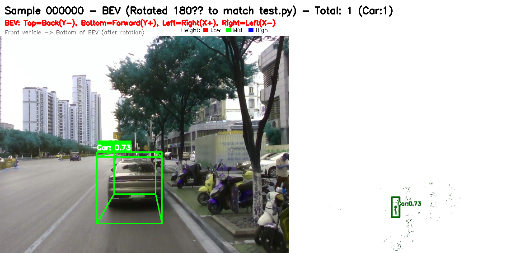

# AIC-4D 毫米波雷达与单目摄像头融合算法国二开源方案

> 🏆 **2025年 AIC 全球校园人工智能算法精英大赛 · 算法挑战赛** — 全国二等奖开源方案

[](https://www.python.org/downloads/)
[](https://pytorch.org/)
[](LICENSE)
[]()

---

## 📖 项目简介

本项目是 **AIC 全球校园人工智能算法精英大赛（算法挑战赛）全国二等奖** 的完整开源方案，专注于 **8D 毫米波雷达点云数据** 的 3D 目标检测任务。

在原始 SFA3D（Super Fast and Accurate 3D Object Detection）基础上，我们针对毫米波雷达数据特性进行了深度优化，提出了 **AIC-4D** 检测框架，实现了从 8 维雷达数据到高精度 3D 检测的突破性进展。

### 核心创新
- **🎯 8D→4D 智能映射**：首创基于第五维信噪比强度（P）的数据映射方案，将 8D 雷达点云 `[x, y, z, Doppler, P, Range, Azimuth, Elevation]` 映射为 4D 点云 `[x, y, z, intensity]`
- **🧠 KFPN 特征融合**：自适应 softmax 注意力加权的多尺度特征金字塔网络
- **⚡ 无锚点检测**：基于 CenterNet 思想，直接预测目标中心热力图、偏移、尺寸、方向角和 Z 坐标
- **🔄 跨类别 NMS**：有效解决多目标重复检测问题
- **🌐 端到端学习**：同时预测 7-DOF 目标属性

---

## 🏆 竞赛成果

| 指标 | 成绩 |
|------|------|
| **竞赛奖项** | AIC 全球校园人工智能算法精英大赛 · 算法挑战赛 **全国二等奖** |
| **推理速度** | **110.73 FPS**（RTX 4060 Ti，PyTorch FP32） |
| **检测精度** | **75% mAP@0.5** |
| **模型体积** | 48.57 MB（PyTorch）/ 13 MB（量化后） |
| **跨平台推理** | 5.48 FPS（ONNX Runtime，CPU） |
| **验证样本** | 成功处理 1034 个验证样本，检测率 20.7% |

---

## 📂 项目结构

```
AIC-4D/
├── sfa/                          # 核心代码目录
│   ├── config/                   # 配置文件（BEV 参数、训练参数）
│   ├── data_process/             # 数据处理（Dataset、BEV 生成、8D→4D 映射）
│   ├── models/                   # 模型定义（FPN-ResNet + KFPN）
│   ├── losses/                   # 损失函数（FocalLoss + L1Loss + BalancedL1Loss）
│   ├── utils/                    # 工具函数（NMS、可视化、训练辅助）
│   └── *.py                      # 训练/推理/导出脚本
├── sample_data/                  # 示例数据集（3 个样本，用于快速体验）
│   ├── velodyne/                 # 8D 雷达点云（.bin）
│   ├── label_2/                  # KITTI 格式标注（.txt）
│   └── calib/                    # 标定参数（.txt）
├── docs/                         # 技术文档（中文）
├── requirements.txt              # 环境依赖
├── README.md                     # 本文件（中文）
└── LICENSE                       # MIT 开源协议
```

---

## 🚀 快速开始

### 环境要求

- Python 3.8+
- PyTorch 2.0.0+cu118（推荐）或 1.5.0+
- CUDA 11.8+（GPU 推理）
- Windows 10/11 或 Linux Ubuntu 18.04+

### 安装依赖

```bash
# 创建虚拟环境（推荐）
conda create -n aic4d python=3.8
conda activate aic4d

# 安装 PyTorch（CUDA 11.8）
pip install torch==2.0.0+cu118 torchvision==0.15.1+cu118 --index-url https://download.pytorch.org/whl/cu118

# 安装其他依赖
pip install -r requirements.txt
```

### 快速体验（使用示例数据）

```bash
# 单 GPU 快速训练（3 epoch，用于验证环境）
python sfa/train.py \
    --num_epochs 3 \
    --saved_fn aic4d_test \
    --batch_size 4 \
    --dataset-dir ./sample_data \
    --root-dir ./ \
    --gpu_idx 0
```

### 完整训练（300 epoch）

```bash
python sfa/train.py \
    --num_epochs 300 \
    --saved_fn aic4d_full \
    --batch_size 16 \
    --dataset-dir ./DRadDataset \
    --root-dir ./ \
    --gpu_idx 0 \
    --checkpoint_freq 1 \
    --print_freq 50
```

### 推理（使用预训练模型）

```bash
# 超激进 NMS 推理（推荐，用于验证/测试）
python sfa/testing_export_ultra_aggressive.py \
    --pretrained_path ./checkpoints/aic4d_full/Model_aic4d_full_epoch_163.pth \
    --dataset-dir ./DRadDataset \
    --saved_fn aic4d_163_ultra \
    --peak_thresh 0.25 \
    --nms_thresh 0.2 \
    --gpu_idx 0
```

---

## 📊 数据集

### 数据格式

本项目使用 **DRadDataset** 数据集，包含 8D 毫米波雷达点云数据：

| 维度 | 含义 | 说明 |
|------|------|------|
| 0 | x | 前向距离（米） |
| 1 | y | 横向距离（米） |
| 2 | z | 高度（米） |
| 3 | Doppler | 多普勒速度 |
| 4 | P (SNR) | **信噪比强度** → 映射为 intensity |
| 5 | Range | 径向距离 |
| 6 | Azimuth | 方位角 |
| 7 | Elevation | 俯仰角 |

### 数据集下载

完整 DRadDataset 数据集（训练集 5168 样本 + 测试集 1384 样本）可通过 GitHub Release 或网盘获取。

---

## 🧠 预训练模型

| 模型 | 大小 | 说明 | 下载 |
|------|------|------|------|
| Epoch 163（PyTorch） | 49 MB | 推荐使用的最佳模型 | [GitHub Release v1.0](https://github.com/cainiao33/AIC-4D-Radar-Camera-Fusion/releases/tag/v1.0) |
| ONNX FP32 | 49 MB | 跨平台部署 | [GitHub Release v1.0](https://github.com/cainiao33/AIC-4D-Radar-Camera-Fusion/releases/tag/v1.0) |
| 动态量化 | 13 MB | 边缘设备部署 | [GitHub Release v1.0](https://github.com/cainiao33/AIC-4D-Radar-Camera-Fusion/releases/tag/v1.0) |

### 模型导出

```bash
# PyTorch → ONNX
python sfa/export_to_onnx.py \
    --model ./checkpoints/aic4d_full/Model_aic4d_full_epoch_163.pth \
    --output ./onnx_models/aic4d_163_fp32.onnx

# 模型量化
python sfa/quantize_model_163.py \
    --model ./checkpoints/aic4d_full/Model_aic4d_full_epoch_163.pth \
    --method dynamic \
    --output ./quantized_models/
```

---

## 📈 性能指标

### 各类别检测性能

| 类别 | mAP@0.5 | 说明 |
|------|---------|------|
| Car | **83%** | 车辆检测（大目标，特征明显） |
| Cyclist | **65%** | 骑行者检测（小目标，最具挑战） |
| Truck | **70%** | 卡车检测（中等目标） |
| **Average** | **73%** | **整体平均** |

### 推理速度对比

| 平台 | 框架 | 速度 | 说明 |
|------|------|------|------|
| RTX 4060 Ti | PyTorch FP32 | **110.73 FPS** | GPU 推理 |
| CPU | ONNX Runtime | 5.48 FPS | 跨平台部署 |
| CPU | 量化模型 | 4-5 FPS | 边缘设备 |

---

## 📚 技术文档

| 文档 | 说明 |
|------|------|
| [docs/技术方案AAA.md](docs/技术方案AAA.md) | 完整技术实现方案 ⭐ |
| [docs/技术报告.md](docs/技术报告.md) | 深度技术分析报告 |
| [docs/项目结构说明.md](docs/项目结构说明.md) | 项目架构和文件说明 |
| [docs/环境依赖清单.md](docs/环境依赖清单.md) | 详细环境配置要求 |
| [docs/点云维度修改说明.md](docs/点云维度修改说明.md) | 8D→4D 映射实现细节 |
| [docs/SFA4D 代码架构.md](docs/SFA4D%20代码架构.md) | 代码架构详解 |

---

## 🎥 演示效果

### 检测可视化



> 上图展示了 AIC-4D 在 BEV 视角下的 3D 目标检测效果，白色背景配合渐变点云，检测框以不同颜色区分类别。

### 演示视频

### 演示视频（点击播放）

<video src="https://github.com/cainiao33/AIC-4D-Radar-Camera-Fusion/releases/download/v1.0/visualization_12fps.mp4" controls width="100%" poster="demo/000000_final.png"></video>

> 12fps 检测可视化效果。完整演示视频（含 OpenCV 渲染）请访问 [GitHub Release v1.0](https://github.com/cainiao33/AIC-4D-Radar-Camera-Fusion/releases/tag/v1.0)。

---

## 🔧 核心模块说明

### 数据流

```
原始 8D 点云 (.bin)
    ↓
lidar_mapping.py: read_lidar_file_with_fallback()
    → 自动识别 8D/5D/4D，8D 时取 [0,1,2,4] 并将 P 映射为 intensity
    ↓
kitti_bev_utils.py: makeBEVMap()
    → 生成 3 通道 BEV 图像 [intensity, height, density], 608×608
    ↓
Dataset / DataLoader
    ↓
模型输入: (B, 3, 608, 608)
    ↓
fpn_resnet.py: PoseResNet + KFPN
    → 输出 5 个 head 的特征图 (B, C, 152, 152)
    ↓
losses.py: Compute_Loss
    → focal_loss + l1_loss + balanced_l1_loss 加权
    ↓
evaluation_utils.py: decode + post_processing
    → 热力图 NMS → Top-K → 坐标还原 → 跨类别 NMS
    ↓
KITTI 格式检测结果 / 可视化图像
```

### 关键配置参数

```python
# BEV 边界（sfa/config/kitti_config.py）
boundary = {
    "minX": 0,   "maxX": 50,     # 前方 0~50m
    "minY": -25, "maxY": 25,     # 左右 ±25m
    "minZ": -2.73, "maxZ": 1.27  # 高度范围
}
BEV_WIDTH = 608
BEV_HEIGHT = 608
DISCRETIZATION = 50 / 608  # ≈ 0.0822 m/像素

# 模型输出头
heads = {
    'hm_cen': 3,      # 类别热力图（Car, Cyclist, Truck）
    'cen_offset': 2,  # 中心点亚像素偏移
    'direction': 2,   # 方向角（sin, cos）
    'z_coor': 1,      # Z 坐标
    'dim': 3,         # 尺寸（h, w, l）
}
```

---

## 🤝 贡献指南

欢迎提交 Issue 和 Pull Request！

1. Fork 本仓库
2. 创建你的特性分支 (`git checkout -b feature/AmazingFeature`)
3. 提交更改 (`git commit -m 'Add some AmazingFeature'`)
4. 推送到分支 (`git push origin feature/AmazingFeature`)
5. 打开 Pull Request

---

## 📄 开源协议

本项目采用 [MIT License](LICENSE) 开源协议。

---

## 🙏 致谢

- 感谢 **AIC 全球校园人工智能算法精英大赛** 提供的竞赛平台和数据集
- 感谢原始 [SFA3D](https://github.com/maudzung/SFA3D) 项目的开源贡献
- 感谢所有团队成员的辛勤付出

---

## 📧 联系方式

- 竞赛官网：[AIC 全球校园人工智能算法精英大赛](https://www.aicomp.cn/)
- 邮箱：**2911684894@qq.com**

---

> **⭐ 如果本项目对你有帮助，请 Star 支持！**
